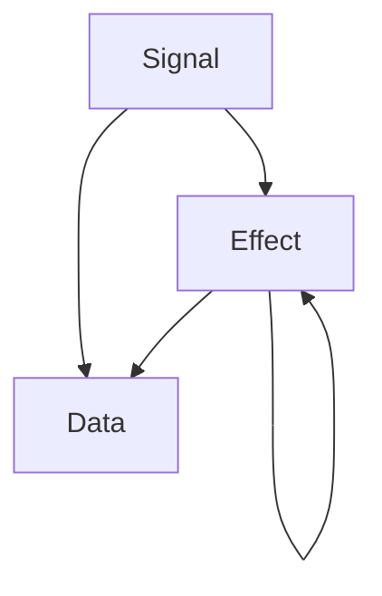

# Transmission

[](https://jitpack.io/#Trendyol/transmission)

Abstraction experiment. Kotlin library to create a communication network between different business logic blocks for your Android Projects.

## Motivation

Business logic can accumulate for complex screens in Android quite quickly.

Business logic is abstracted to some controller class, UseCase, or something similar to control and maintain the complexity.

However, the reactive nature of the data we present on the screen often prevents us from genuinely decoupling this logic. For example, in scenarios where one part of the screen controls another, they must be updated together.

This library brings an additional layer to this complexity, intending to decouple the business logic blocks from each other.

You can read more about motivation and how the library works [here](https://medium.com/@yigitozgumus/decoupling-business-logic-in-android-projects-8f1daa209fcb).

## Installation

The library is distributed through Jitpack.

**Add the repository to the root build.gradle**

```kotlin
repositories {
	maven { url("https://jitpack.io") }
}
```

**Add the library to the dependencies block of your app's module build.gradle** (And any module you need to use)

```kotlin
implementation("com.github.Trendyol:transmission:<latest_version>")
```

## How to use it?

The library consists of the following building blocks:
- **Transmission**: Unit of information being transferred. Three subtypes are: _signal_, _effect_, and _data_.
- **Transformer**: Processes _transmission_. Might receive _signal_ or _effect_ and might produce either an _effect_ or _data_.
- **TransmissionRouter**: Processes incoming signals and effects and passes along the produced data. Responsible for distributing the _signals_ and _effects_ between **Transformers**.

`Transmission` interactions are depicted below:



### How to create a Transformer

Transformers are responsible for handling `signal`s and `effect`s. They have an inner class called `TransmissionHataHolder` which can hold any Data type that is extended from `Transmission.Data`. Any update to the dataHolder automatically publishes the latest version to Data Channel. 

```kotlin
class InputTransformer @Inject constructor() : DefaultTransformer() {
    
    private val holder = buildDataHolder(InputUiState())

	override val signalHandler = buildGenericSignalHandler { signal ->
		when (signal) {
			is InputSignal.InputUpdate -> { 
                holder.update { it.copy(writtenText = signal.value) }
				sendEffect(InputEffect.InputUpdate(signal.value))
			}
		}
	}

	override val effectHandler = buildGenericEffectHandler { effect ->
		when (effect) {
			is ColorPickerEffect.BackgroundColorUpdate -> {
				holder.update { it.copy(backgroundColor = effect.color) }
			}
		}
	}
}
```

### How to use TransmissionRouter

Possibly in your ViewModel:

```kotlin
init {  
    transmissionRouter.initialize(onData = {}, onEffect = {})    
}
```

The TransmissionRouter takes a set of `Transformer`s as a parameter. Building the Router heavily depends on your app's architecture and dependency injection choices. Here is an approach from the sample app using Hilt:

```kotlin
@InstallIn(ViewModelComponent::class)  
@Module  
interface FeaturesModule {  
  
    @Multibinds  
    fun bindTransformerSet(): Set<DefaultTransformer>  
  
    @Binds  
    @IntoSet    
    fun bindInputTransformer(impl: InputTransformer): DefaultTransformer
  
    @Binds    
    @IntoSet    
    fun bindOutputTransformer(impl: OutputTransformer): DefaultTransformer  
  
    @Binds    
    @IntoSet    
    fun bindColorPickerTransformer(impl: ColorPickerTransformer): DefaultTransformer  
  
    @Binds    
    @IntoSet    
    fun bindMultiOutputTransformer(impl: MultiOutputTransformer): DefaultTransformer
  
    companion object {  
       @Provides  
       fun provideRouter(
           transformerSet: @JvmSuppressWildcards Set<DefaultTransformer>
       ): DefaultTransmissionRouter {
          return TransmissionRouter(transformerSet)  
       }  
    }  
  
}
```

## License

This library is released under the MIT license. See [LICENSE](LICENSE) for details.
