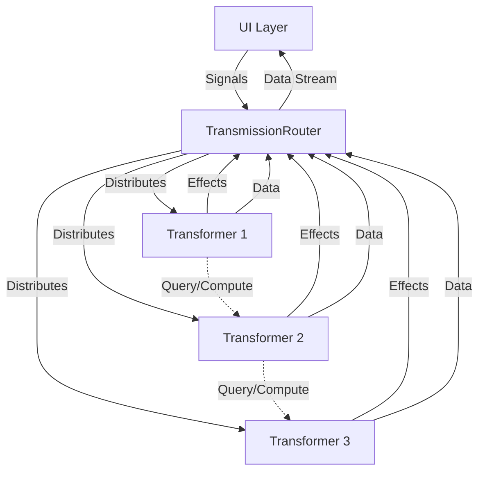

# Transmission

Transmission is an experimental asynchronous communication library for Kotlin Multiplatform projects, designed to create a structured communication network between different business logic components. It provides a clean, testable architecture that enables different parts of your application to communicate without direct references.

## Core Concepts

Transmission is built around three primary concepts:

- **[Transmission](transmissions.md)**: The fundamental unit of information (Signal, Effect, Data)
- **[Transformer](transformer.md)**: Components that process transmissions and handle business logic
- **[TransmissionRouter](router.md)**: Manages the flow of transmissions between transformers

## Key Features

- **Decoupled Communication**: Components communicate without direct references
- **Structured Flow**: Clear information flow through Signal → Effect → Data channels
- **Testable Architecture**: Built with testing in mind for better business logic testing
- **Asynchronous By Design**: Built for asynchronous operations from the ground up
- **Kotlin Multiplatform**: Works across all Kotlin targets

## Architecture Overview



## Quick Start

### 1. Define Transmissions

```kotlin
// Signals from UI
sealed interface CounterSignal : Transmission.Signal {
    data object Increment : CounterSignal
    data object Decrement : CounterSignal
}

// Data for UI consumption  
data class CounterData(val count: Int) : Transmission.Data
```

### 2. Create a Transformer

```kotlin
class CounterTransformer : Transformer() {
    private var count = 0
    
    override val handlers: Handlers = handlers {
        onSignal<CounterSignal.Increment> {
            count++
            send(CounterData(count))
        }
        
        onSignal<CounterSignal.Decrement> {
            count--
            send(CounterData(count))
        }
    }
}
```

### 3. Set up Router

```kotlin
val router = TransmissionRouter {
    addTransformerSet(setOf(CounterTransformer()))
}
```

### 4. Use in UI

```kotlin
// Send signals
router.process(CounterSignal.Increment)

// Observe data
router.dataStream
    .filterIsInstance<CounterData>()
    .collect { data ->
        // Update UI with data.count
    }
```

## Project Structure

```
transmission/
├── transmission/           # Core library
├── transmission-test/      # Testing utilities  
├── samples/               # Example implementations
│   ├── counter/          # Simple counter example
│   └── components/       # Complex multi-component example
└── docs/                 # Documentation
```

## Getting Started

1. **[Setup](setup.md)** - Add Transmission to your project
2. **[How to Use](how_to_use.md)** - Basic usage guide
3. **[Transmissions](transmissions.md)** - Understanding Signal, Effect, and Data
4. **[Transformer](transformer.md)** - Creating business logic components
5. **[TransmissionRouter](router.md)** - Managing communication flow

## Examples

Check out the complete examples in the `samples` directory:

- **Counter Sample**: Simple increment/decrement counter demonstrating basic concepts
- **Components Sample**: Complex example with multiple transformers, effects, and inter-transformer communication