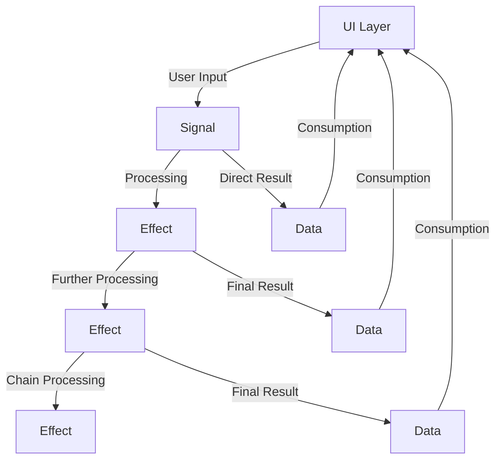

# Transmissions

A **Transmission** is the fundamental unit of information in the Transmission library. All communication between components flows through these transmission types.

## The Three Types

```kotlin
sealed interface Transmission {
    interface Signal : Transmission
    interface Effect : Transmission  
    interface Data : Transmission
}
```

## Signal

**Signals** represent input from UI or external events that should trigger business logic processing.

### Characteristics
- Entry point for user interactions
- Processed by TransmissionRouter
- Distributed to relevant Transformers
- Should be immutable data classes or objects

### Examples

```kotlin
// Simple signal
data object RefreshSignal : Transmission.Signal

// Signal with data
data class SearchSignal(val query: String) : Transmission.Signal

// Sealed interface for grouped signals
sealed interface CounterSignal : Transmission.Signal {
    data object Increment : CounterSignal
    data object Decrement : CounterSignal
    data class SetValue(val value: Int) : CounterSignal
}
```

### From Counter Sample

```kotlin
sealed interface CounterSignal : Transmission.Signal {
    data object Lookup : CounterSignal
}
```

### From Components Sample

```kotlin
sealed interface InputSignal : Transmission.Signal {
    data class InputUpdate(val value: String) : InputSignal
}

sealed interface ColorPickerSignal : Transmission.Signal {
    data class ColorSelected(val color: Color) : ColorPickerSignal
}
```

## Effect

**Effects** represent side effects or intermediate processing steps that can trigger additional business logic.

### Characteristics
- Created from Signals or other Effects
- Can trigger further processing
- Represent intermediate states in business logic
- Can be sent between Transformers

### Examples

```kotlin
// Logging effect
data class LogEffect(val message: String, val level: LogLevel) : Transmission.Effect

// Navigation effect  
data class NavigateEffect(val destination: String) : Transmission.Effect

// Network effect
sealed interface NetworkEffect : Transmission.Effect {
    data class LoadData(val url: String) : NetworkEffect
    data class SaveData(val data: Any) : NetworkEffect
}
```

### From Components Sample

```kotlin
sealed interface InputEffect : Transmission.Effect {
    data class InputUpdate(val value: String) : InputEffect
}

sealed interface ColorPickerEffect : Transmission.Effect {
    data class SelectedColorUpdate(val color: Color) : ColorPickerEffect
    data class BackgroundColorUpdate(val color: Color) : ColorPickerEffect
}
```

## Data

**Data** represents the final result of business logic processing, ready for consumption by UI or other components.

### Characteristics
- Final output of Transformer processing
- Consumed by UI components
- Should represent complete, ready-to-use information
- Flows through the router's data stream

### Examples

```kotlin
// Simple data
data class UserData(val id: String, val name: String) : Transmission.Data

// UI state data
data class CounterData(val count: Int, val isLoading: Boolean) : Transmission.Data

// List data
data class ItemListData(val items: List<Item>) : Transmission.Data
```

### From Counter Sample

```kotlin
data class CounterData(val id: String) : Transmission.Data
```

### From Components Sample

```kotlin
data class InputUiState(
    val writtenText: String = "",
    val backgroundColor: Color = Color.White
) : Transmission.Data
```

## Flow Relationships

The relationship between these types follows predictable patterns:



## Processing in Transformers

Here's how transmissions are processed within Transformers:

```kotlin
class ExampleTransformer : Transformer() {
    override val handlers: Handlers = handlers {
        // Handle incoming Signal
        onSignal<SearchSignal> { signal ->
            // Can produce Effects
            publish(LogEffect("Searching for: ${signal.query}", LogLevel.INFO))
            
            // Can produce Data directly
            send(SearchResultsData(searchResults = performSearch(signal.query)))
        }
        
        // Handle incoming Effect  
        onEffect<LogEffect> { effect ->
            // Process the effect
            logger.log(effect.level, effect.message)
            
            // Can produce other Effects
            if (effect.level == LogLevel.ERROR) {
                publish(NotificationEffect("Error occurred"))
            }
        }
    }
}
```

## Best Practices

### Signal Design
- Keep signals simple and focused
- Use sealed interfaces for related signals
- Include only necessary data
- Make them immutable

```kotlin
// Good
sealed interface UserSignal : Transmission.Signal {
    data class Login(val credentials: Credentials) : UserSignal
    data object Logout : UserSignal
}

// Avoid
data class UserSignal(
    val action: String, // String-based actions are error-prone
    val data: Any?      // Generic data is not type-safe
) : Transmission.Signal
```

### Effect Design
- Use effects for side effects and intermediate processing
- Chain effects for complex workflows
- Keep effects focused on single responsibilities

```kotlin
// Good - focused effects
data class ValidateInputEffect(val input: String) : Transmission.Effect
data class SaveDataEffect(val data: UserData) : Transmission.Effect

// Better - sealed interface for related effects
sealed interface UserEffect : Transmission.Effect {
    data class Validate(val input: String) : UserEffect
    data class Save(val data: UserData) : UserEffect
    data class Delete(val id: String) : UserEffect
}
```

### Data Design
- Make data complete and ready for consumption
- Include all necessary information for UI
- Keep data immutable

```kotlin
// Good - complete UI state
data class ProfileData(
    val user: User,
    val isLoading: Boolean,
    val error: String?
) : Transmission.Data

// Avoid - incomplete information
data class ProfileData(val userId: String) : Transmission.Data // UI needs more info
```