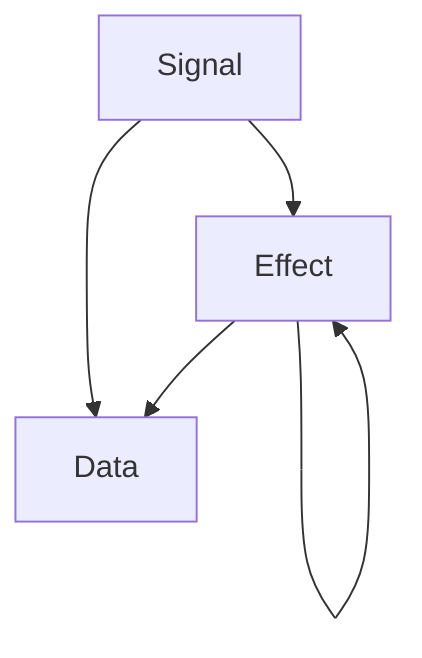

# Transmissions

In the Transmission library, a **Transmission** is the basic unit of information being transferred through the system. It is the fundamental concept upon which the entire library is built.

There are three types of Transmissions:

## Signal

**Signal** is a transmission type that should come from UI or external inputs. The TransmissionRouter processes Signals and distributes them to Transformers.

Signals represent user interactions or system events that should trigger business logic.

## Effect

**Effect** is a transmission type that is used as a Side Effect. Effects can be created from Signals or other Effects.

Effects represent intermediate steps in business logic processing that might lead to additional processing or state changes.

## Data

**Data** is the main representation of information that your application components consume. Usually, Signals and Effects are converted into Data after processing inside Transformers.

Data represents the final result of business logic processing that is ready to be consumed by UI or other components.

## Relationships

The relationship between these three types can be represented as follows:

This flow illustrates how:
- A Signal can produce an Effect or Data
- An Effect can produce another Effect or Data
- The ultimate goal is to produce Data for consumption