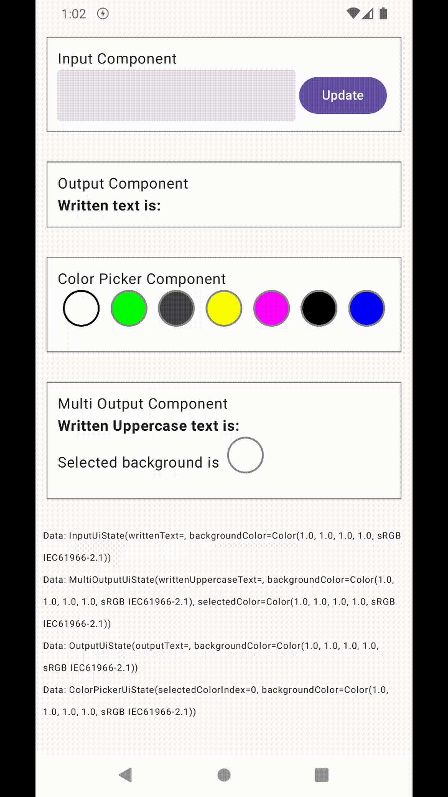

# Sample

## Sample App Scenario

The sample app has four components: Input, Output, ColorPicker, and MultiOutput.
- The **input component** has a text field, which, when pressed "update," sends the written text to the Output and MultiOutput components. The color of the input component's background can be changed using the ColorPicker Component.
- **Output component** can show written text of Input Component and its background color can be changed using Color Picker Component.
- The **ColorPicker component** has a set of colors, and when pressed, it sends a color update to all the components, including itself. Its background color can also be changed.
- The **MultiOutput component** is similar to the output component. It shows the written text in uppercase. it also shows the selected color of the ColorPicker component.

Here is a quick demo:

	

